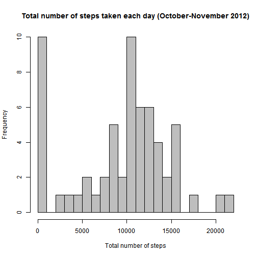
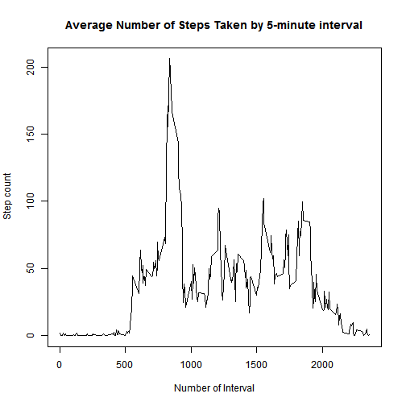
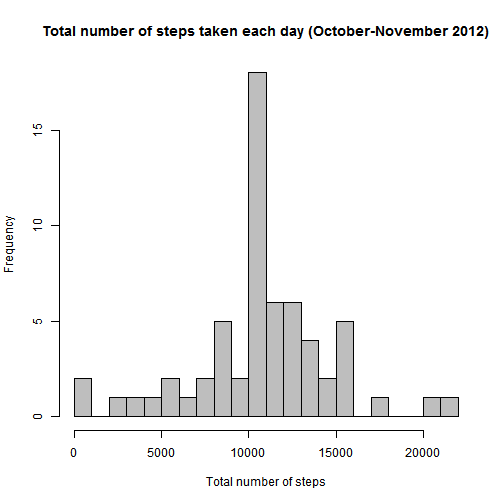
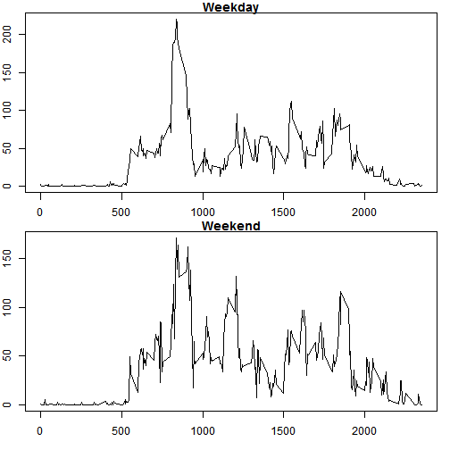

*Assignment 1 for Reproducible research course*

First step is to download the data and create the data frame for the analysis


```r
act_data<-read.csv("C://Users//пользователь//Downloads//activity.csv",header=TRUE,sep=",")
act_data$date<-as.POSIXct(act_data$date, format="%Y-%m-%d")
```

Now we can analyze our data and answer the following questions:

1. What is mean total number of steps taken per day?

2. What is the average daily activity pattern?

3. Are there differences in activity patterns between weekdays and weekends?

**What is mean total number of steps taken per day?**


```r
dates<-data.frame(row=1:61,date=c(unique(act_data$date)))
steps<-by(act_data$steps,act_data$date,sum,na.rm=TRUE)
stepsbydate<-data.frame(as.POSIXct(dates[,2], format="%Y-%m-%d"),c(steps))
row.names(stepsbydate)<-NULL
mean(stepsbydate[,2],na.rm=TRUE)
```

```
## [1] 9354.23
```

```r
median(stepsbydate[,2],na.rm=TRUE)
```

```
## [1] 10395
```

Now we can plot a histogram of the total number of steps taken each day

 

**What is the average daily activity pattern?**

To establish that we need to calculate the mean of steps taken in every 5 minute interval and make a time series plot.

 

We also need to know which interval comtains the maximum number of steps


```r
max(stepsbyinterval$steps,na.rm=TRUE)
```

```
## [1] 206.1698
```

```r
stepsbyinterval$interval[stepsbyinterval$steps == max(stepsbyinterval$steps)]
```

```
## [1] 835
```

Our data frame contains some missimg values (NA), which may affect the analysis.
First we need to find how many missing values we have.


```r
sum(is.na(act_data$steps))
```

```
## [1] 2304
```

In the new data set missing values were filled in with the mean for that day.


To compare two data sets we calculated the mean and median for the new data set and created histogram of the total number of steps taken each day


```r
steps2<-by(act_data2$steps,act_data2$date,sum,na.rm=TRUE)
stepsbydate2<-data.frame(as.POSIXct(dates[,2], format="%Y-%m-%d"),c(steps2))
row.names(stepsbydate2)<-NULL
mean(stepsbydate2[,2],na.rm=TRUE)
```

```
## [1] 10766.19
```

```r
median(stepsbydate2[,2],na.rm=TRUE)
```

```
## [1] 10766.19
```

```r
hist(stepsbydate2$c.steps,breaks = seq(0,22000,1000),col="grey",
main="Total number of steps taken each day (October-November 2012)",
xlab="Total number of steps")
```

 

**Are there differences in activity patterns between weekdays and weekends?**

First we need to add a column specifing whether day was week day of weekend

```r
list_of_days <- as.Date(stepsbydate2[,1])
names_of_days <- weekdays(list_of_days)
act_data2$wday <- weekdays(as.Date(act_data2$date))
d <- ifelse(act_data2$wday %in% c('суббота','воскресенье'), 
            "weekend", "weekday")
act_data2$wknd_or_not <- d
```

Now we can divide the data frame on two: first one will contain information about weekdays and the second - about weekends


```r
act_data2weekday <- subset(act_data2, wknd_or_not == "weekday")
act_data2weekend <- subset(act_data2, wknd_or_not == "weekend")
```

Next we can calculate the average number of steps taken for the 5-minute intervals and make the plot
 

